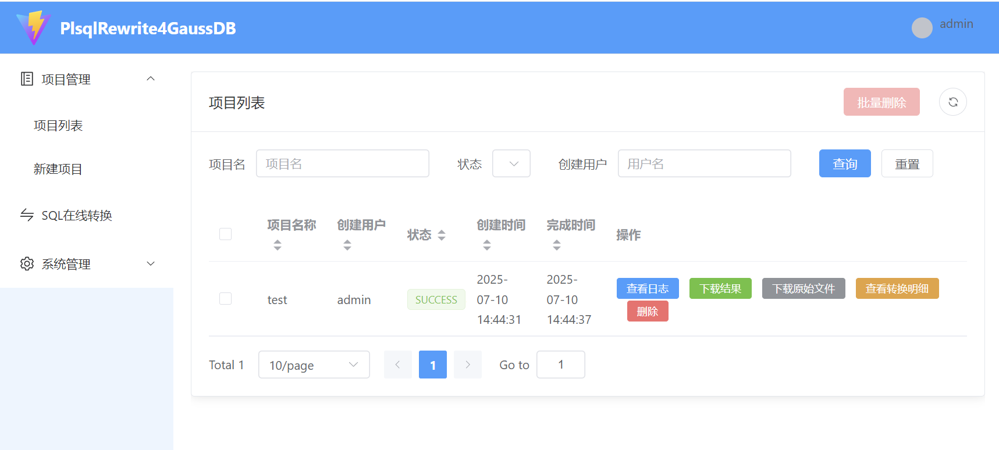
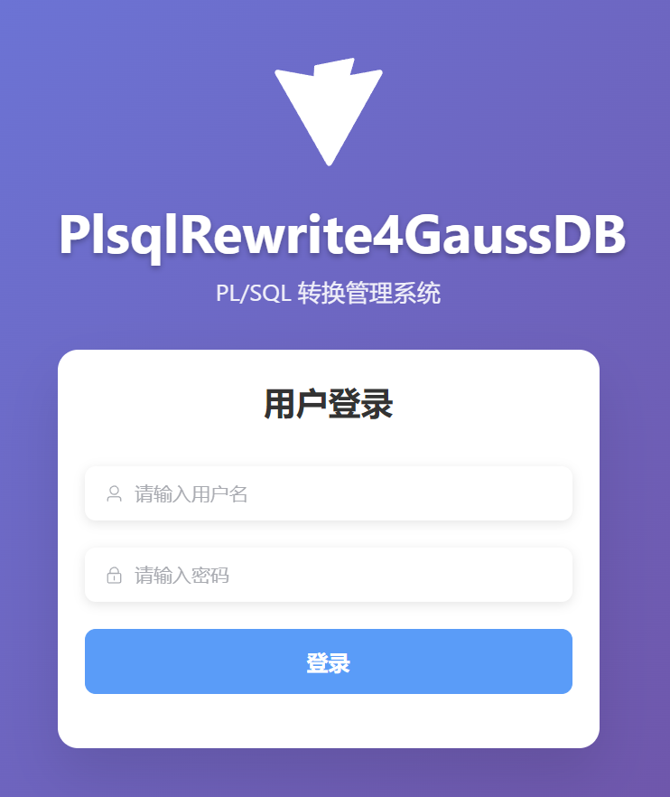
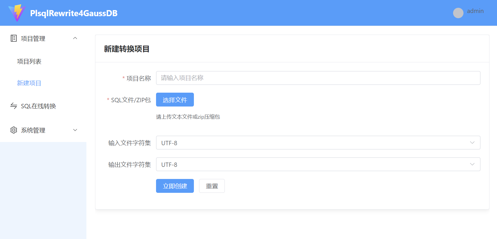
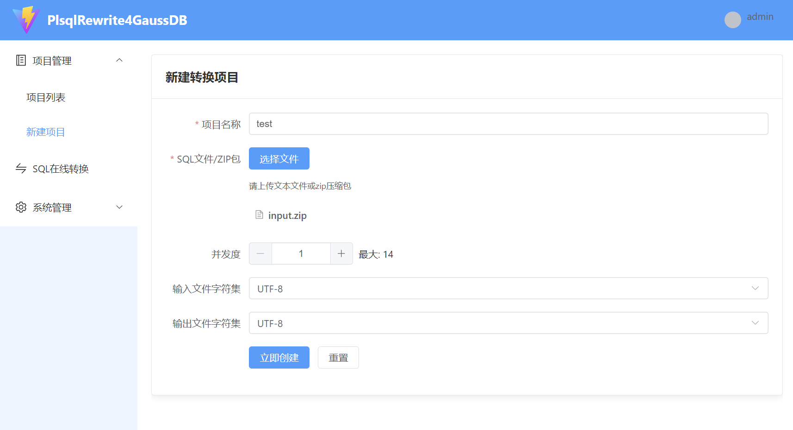
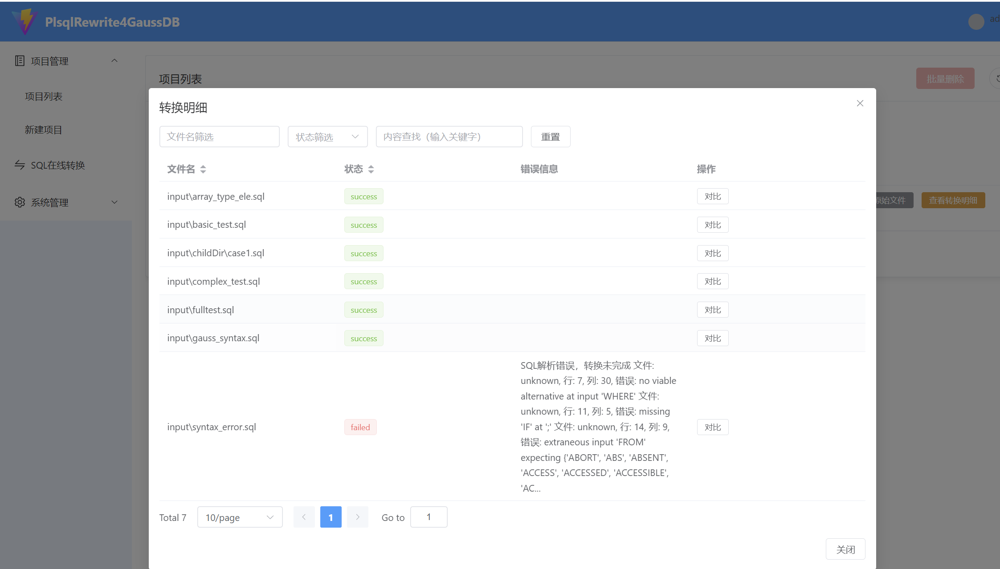
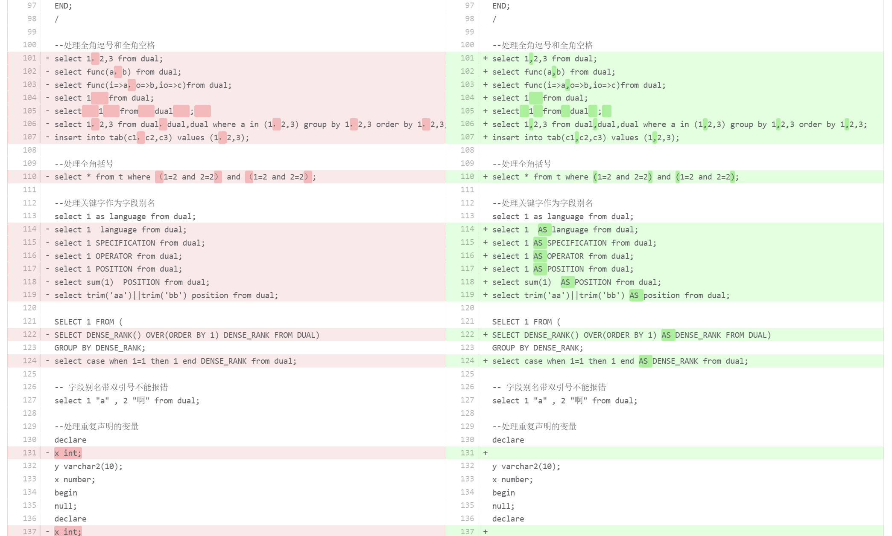
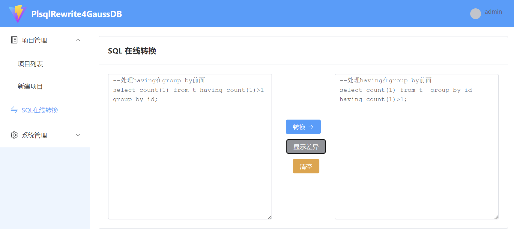

# PlSqlRewrite4GaussDB

<div align="center">


**🚀 开源、可自定义的PL/SQL转GaussDB工具**

*让Oracle到GaussDB的PLSQL迁移变得简单高效*

[📖 核心模块文档](./readme_core.md) | [🔧 快速开始](#快速开始) | [📋 功能特性](#功能特性) 

</div>

---

## 📋 目录

- [项目简介](#项目简介)
- [功能特性](#功能特性)
- [系统架构](#系统架构)
- [快速开始](#快速开始)
- [详细使用指南](#详细使用指南)
- [配置说明](#配置说明)
- [开发指南](#开发指南)
- [常见问题](#常见问题)
- [更新日志](#更新日志)
- [贡献指南](#贡献指南)
- [许可证](#许可证)

## 🎯 项目简介

PlSqlRewrite4GaussDB 是一款专为国产化改造设计的开源PL/SQL转换工具，旨在解决Oracle到GaussDB迁移过程中的核心痛点：

### 🔥 解决的核心问题

| 问题 | 传统方案痛点 | 我们的解决方案 |
|------|-------------|---------------|
| **语法兼容性** | 原厂工具转换后仍需手动修改 | ✅ 内置50+转换规则，结合自定义转换规则，代码转换把控在自己手中 |
| **规则定制** | 无法自定义转换规则 | ✅ 灵活配置系统，支持自定义规则 |
| **版本同步** | 源端更新需重复转换和手动修改 | ✅ 自定义规则可覆盖原厂工具的缺陷，使转换后不再需要人工修改成为可能 |
| **响应速度** | 新语法支持需等待数月 | ✅ 开源架构，可快速扩展新规则 |
| **可被集成** | 无法集成到用户自己的平台中 | ✅ 可以用命令行方式或api方式集成 |

### 🌟 核心优势

- **🔧 高度可定制**：支持语法节点级和正则表达式级自定义规则
- **⚡ 高性能**：支持多线程批量处理，大幅提升转换效率
- **🎯 精准转换**：基于ANTLR4语法分析，确保转换准确性
- **🔄 持续更新**：开源架构，支持快速响应新需求
- **📊 可视化界面**：提供完整的Web管理界面

## 🚀 功能特性

### 核心转换能力

#### 🔄 语法转换
- **数据类型映射**：`PLS_INTEGER` → `INTEGER`、`CHAR` → `VARCHAR2`
- **函数替换**：`SYS_CONTEXT` → `pg_current_sessid()` 等
- **关键字处理**：自动添加`AS`关键字避免冲突
- **异常处理**：`RAISE_APPLICATION_ERROR` → `REPORT_APPLICATION_ERROR`

#### 🎯 高级功能
- **动态SQL处理**：支持`EXECUTE IMMEDIATE`动态SQL转换
- **游标优化**：自动移除不必要的`SELECT INTO`
- **性能优化**：`TABLE()`函数优化、连接条件优化
- **字符集处理**：支持全角/半角字符自动转换

#### ⚙️ 配置系统
- **映射文件**：支持数据类型、函数、异常等映射配置
- **正则规则**：支持自定义正则表达式替换
- **查询块替换**：支持基于哈希值的整段SQL替换
- **参数模板**：支持批量参数配置

### 技术架构

```
┌─────────────────┐    ┌─────────────────┐    ┌─────────────────┐
│   前端界面      │    │   后端服务      │    │   转换核心      │
│   (Vue.js)      │◄──►│  (Spring Boot)  │◄──►│   (ANTLR4)      │
│                 │    │                 │    │                 │
│ • 项目管理      │    │ • REST API      │    │ • 语法解析      │
│ • SQL转换       │    │ • 用户认证      │    │ • 规则转换      │
│ • 批量处理      │    │ • 文件管理      │    │ • 配置管理      │
└─────────────────┘    └─────────────────┘    └─────────────────┘
```

## 🏗️ 系统架构

### 模块组成

```
PlSqlRewrite4GaussDB/
├── 📁 src/                    # 转换核心模块
│   ├── 📁 main/java/         # 核心转换逻辑
│   ├── 📁 test/              # 单元测试
│   └── 📁 resources/         # ANTLR4语法文件
├── 📁 webapp/                # 后端服务模块
│   ├── 📁 controller/        # REST API控制器
│   ├── 📁 service/           # 业务逻辑服务
│   └── 📁 model/             # 数据模型
├── 📁 frontend/              # 前端界面模块
│   ├── 📁 src/               # Vue.js源码
│   └── 📁 public/            # 静态资源
└── 📁 config/                # 配置文件目录
    ├── 📄 *.properties       # 各种映射配置
    └── 📄 *.yaml            # 高级规则配置
```

<div align="center">
  
  <br/>
  <em>Web端项目列表界面预览</em>
</div>

### 技术栈

| 模块 | 技术栈 | 版本 |
|------|--------|------|
| **转换核心** | Java + ANTLR4 | Java 11+, ANTLR4 4.13.2 |
| **后端服务** | Spring Boot | 3.2.5 |
| **前端界面** | Vue.js + Element Plus | Vue 3.5.17 |
| **数据库** | SQLite | 3.45.1.0 |

## 🚀 快速开始

### 环境要求

- **Java**: JDK 17+ (推荐JDK 17)
- **Node.js**: 16+ (仅前端开发需要)
- **Maven**: 3.6+ (可选，转换核心支持离线构建)

### 一键构建

```bash
# 克隆项目
git clone https://gitee.com/darkathena/PlsqlRewrite4GaussDB-web.git
cd PlsqlRewrite4GaussDB-web

# 一键构建所有模块
./build_full_release.sh    # Linux/Mac
build_full_release.bat     # Windows
```

### 快速启动

```bash
# 进入release目录
cd release

# 启动服务
./start_server.sh          # Linux/Mac
start_server.bat           # Windows
```

访问 http://127.0.0.1:8080，使用默认账号 `admin/password` 登录。

## 📖 详细使用指南

### 1. 命令行使用

#### 单文件转换
```bash
# 基本转换
java -jar plsql-rewriter.jar input.sql output.sql

# 指定字符集
java -jar plsql-rewriter.jar input.sql output.sql GBK UTF-8

# 使用便捷脚本
./convert.sh input.sql output.sql
```

#### 批量转换
```bash
# 批量转换（10个并发）
java -jar plsql-rewriter.jar input_dir output_dir 10

# 使用便捷脚本
./batch_convert.sh input_dir output_dir 10
```

### 2. Web界面使用

#### 登录界面

<div align="center">
  
</div>

#### 创建项目

<div align="center">
  
  
</div>

#### 项目列表

<div align="center">
  
</div>

#### 转换详情与差异对比

<div align="center">
  
  
</div>

#### 在线SQL转换

<div align="center">
  
</div>


#### 项目管理
1. **创建项目**：设置项目名称和描述
2. **上传文件**：支持单个或批量上传SQL文件
3. **执行转换**：一键转换所有文件，可在线对比差异
4. **在线转换**：粘贴SQL直接转换

#### 转换配置
- **基础配置**：数据类型映射、函数替换等
- **高级配置**：正则表达式规则、查询块替换等

## ⚙️ 配置说明

### 核心配置文件

```
├─config                          # 配置文件目录
│  ├─add_func_into_pkg        # 对指定package增加自定义函数
│  ├─replace_func_into_pkg        # 对指定package替换自定义函数
│  ├─query_block_hash_map        # 基于哈希值的查询块替换配置
│  ├─atom_mapping.properties      # 字段函数转换配置
│  ├─config.properties           # 通用配置
│  ├─datatype_mapping.properties # 数据类型映射
│  ├─dynamic_sql.yaml # 动态SQL替换规则
│  ├─exception_mapping.properties # 异常名称映射
│  ├─general_element_mapping.properties # 函数表达式映射
│  ├─patterns.yaml              # 正则替换规则
│  ├─query_block_mapping.properties # 查询块规则
│  ├─regular_id_mapping.properties # 标识符映射
│  ├─token_mapping.properties    # 词法标记映射
│  └─udtlist.properties         # 自定义类型列表
```

### 配置示例

```properties
# config.properties
tablefunctionreplace=unnest
ownerconvert=schema
convert_table_of_ele_to_select=true

# datatype_mapping.properties
PLS_INTEGER=INTEGER
NUMBER=NUMERIC
LONG=TEXT
```

```yaml
# patterns.yaml
rules:
  - pattern: for\s*(\w*)\s*in\s*(\w*)\.first\s*\.\.\s*\w*\.last 
    replacement: for $1 in 1..$2.count
```

## 🛠️ 开发指南

### 环境搭建

```bash
# 1. 构建转换核心
mvn clean package

# 2. 构建后端服务
cd webapp
mvn clean package

# 3. 构建前端界面
cd frontend
npm install
npm run build
```

### 测试框架

```bash
# 运行所有测试
mvn test

# 运行特定测试
mvn test -Dtest=PlSqlRewriterTest#testBasicConversion

# 手动测试
./convert.sh test.sql output.sql
./compare.sh output.sql expected.sql
```

## ❓ 常见问题

### Q: 转换后的SQL仍有语法错误怎么办？
A: 检查配置文件中是否有遗漏的映射规则，或使用正则表达式规则进行兜底处理。

### Q: 如何添加新的数据类型映射？
A: 在 `config/datatype_mapping.properties` 文件中添加映射关系，格式为 `源类型=目标类型`。

### Q: 批量转换时内存不足怎么办？
A: 减少并发数量，或分批处理文件。

### Q: 如何自定义函数替换规则？
A: 根据场景，使用token_mapping.properties或atom_mapping.properties或general_element_mapping.properties或patterns.yaml。

### Q: 转换性能如何优化？
A: 使用批量转换模式，合理设置并发数，避免处理过大的单个文件。

## 💡注意事项
1. 本项目输入的SQL文件需要满足在sqlplus中可执行的SQL格式，若语法解析错误则直接失败
2. 本项目转换规则未覆盖ORACLE的所有语法规则，且部分默认自定义配置选项并非是所有场景的等价转换规则，请自行调整规则
3. 多个规则之间起冲突可能导致转换失败，请自行调整规则

## 📝 更新日志

### v0.0.0 (2024-11-28)
- ✨ 初始版本发布
- 🚀 支持50+核心转换规则
- 🔧 灵活的配置系统
- ⚡ 高性能批量处理

### v1.0.0 (2025-07-11)
- 🎨 完整的Web管理界面

## 🤝 贡献指南

我们欢迎所有形式的贡献！

### 贡献方式

1. **报告问题**：在GitHub Issues中报告bug或提出建议
2. **提交代码**：Fork项目并提交Pull Request
3. **完善文档**：帮助改进文档和示例
4. **分享经验**：分享使用经验和最佳实践

### 开发流程

1. Fork项目到你的GitHub账户
2. 创建功能分支：`git checkout -b feature/your-feature`
3. 提交更改：`git commit -am 'Add some feature'`
4. 推送分支：`git push origin feature/your-feature`
5. 提交Pull Request

### 代码规范

- 遵循Java代码规范
- 添加适当的注释和文档
- 确保所有测试通过
- 更新相关文档

## 📄 许可证

本项目采用 [MIT License](./LICENSE) 开源许可证。

## 🙏 致谢

感谢以下开源项目的支持：

- [ANTLR4](https://www.antlr.org/) - 强大的语法解析器生成器
- [Spring Boot](https://spring.io/projects/spring-boot) - 企业级Java框架
- [Vue.js](https://vuejs.org/) - 渐进式JavaScript框架
- [Element Plus](https://element-plus.org/) - Vue 3组件库

---

<div align="center">

**如果这个项目对你有帮助，请给我们一个 ⭐ Star！**

[](https://gitee.com/darkathena/PlsqlRewrite4GaussDB)

</div>
